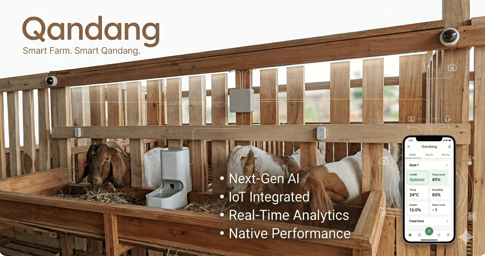

# 🐐 Qandang - Smart Livestock Monitoring System

[](https://github.com/akusopo1945/qandang/actions/workflows/build_apk.yml)



**Qandang** is a modern Smart Farming platform designed for digital goat livestock monitoring using QR Codes and IoT integration. It helps farmers track growth, health records, and barn environments in real-time.

---

## 📱 Mobile App (APK)

Aplikasi mobile dibangun secara otomatis menggunakan GitHub Actions. 

**Cara Download APK:**
1. Pergi ke tab **[Actions](https://github.com/akusopo1945/qandang/actions)** di repository ini.
2. Klik pada workflow run terbaru yang berwarna hijau (sukses).
3. Scroll ke bawah ke bagian **Artifacts**.
4. Download file **qandang-release-apk**.

---

## 🚀 Key Features

1.  **QR Identification**: Unique digital identity per goat. Scan to see full history.
2.  **Health Records**: Track vaccinations, medical history, and weight logs.
3.  **AI Growth Prediction (Phase 2)**: Dynamic charts and AI-powered growth forecasts with health scoring.
4.  **IoT Integration (Phase 3)**: Monitor barn temperature and humidity via MQTT.
5.  **Offline-First Mobile**: Designed for field operations with local sync.

---

## 📖 Documentation

- **[User Manual (Panduan Pengguna)](docs/USER_MANUAL.md)**: Panduan lengkap penggunaan aplikasi untuk peternak.
- **AI Prediksi**: Fitur unggulan untuk memprediksi berat badan ternak di bulan mendatang.

## 🛠 Tech Stack

-   **Backend**: Laravel 12 (PHP 8.2+) & Filament Dashboard
-   **Frontend Web**: Tailwind CSS & Alpine.js
-   **Mobile**: Flutter (Dart)
-   **AI Service**: Python FastAPI (Growth Prediction)
-   **Database**: PostgreSQL
-   **IoT**: MQTT (ESP32 Sensors)
-   **Gateway**: Node.js Express Proxy

---

## 📂 Directory Structure

-   `/backend`: Laravel API, Filament Admin & Analytics.
-   `/frontend_mobile`: Flutter application for field use.
-   `/ai-service`: Python FastAPI prediction engine.
-   `/iot`: Firmware and MQTT configurations.
-   `/docs`: Technical documentation.

---

## ⚙️ Installation & Setup

### 1. Gateway (Root)
```bash
npm install
npm start # Runs on port 4501
```

### 2. Backend (Laravel)
```bash
cd backend
composer install
npm install
npm run build
php artisan migrate --seed
php artisan serve --port=8001
```

### 3. AI Service (FastAPI)
```bash
cd ai-service
python -m venv venv
source venv/bin/activate
pip install -r requirements.txt
uvicorn app.main:app --port 8501
```

---

## 🌐 Deployment

Current production setup:
-   **URL**: [https://qandang.duckdns.org/](https://qandang.duckdns.org/)
-   **Process Manager**: PM2 handles `qandang-gateway`, `qandang-backend`, and `qandang-ai`.

---

## 👥 Authors
Developed by **CakDoel & theGong** © 2026 Qandang. All rights reserved.
